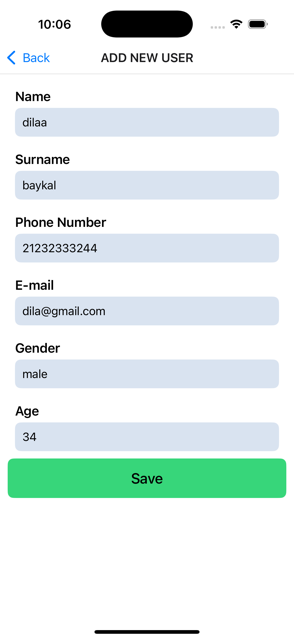

# User List Application

This is a simple User List application built with React Native and Redux Toolkit. The application uses the RandomUser API to fetch and display user data, allowing you to manage user information with features such as delete and update.

## Screenshots 🖼️

### Video GIF


### userList


### addNewUser



### userDetail


## Features

- Fetch Users: Fetch random user data from the RandomUser API using asynchronous actions with Redux Thunk.

- List Users: Display the fetched user data in a list.

- Delete Users: Remove a user from the list.

- Update Users: Edit and update user details.

- React Navigation: Navigate seamlessly between screens in the application.

## Technologies Used

- React Native: Frontend framework for building mobile applications.

- Redux Toolkit: State management solution with built-in support for asynchronous operations.

- Redux Thunk: Middleware for handling asynchronous actions.

- Axios: Library for making HTTP requests.

- Formik: Form management library.

- Yup: Validation library used with Formik.

## How It Works

1. ### Fetching Data:

- The app fetches random user data from the RandomUser API using axios.

- Redux Thunk is used to handle asynchronous API requests.

2. ### State Management:

- Redux Toolkit manages the global state for user data.

- Actions and reducers are used for operations like fetching, updating, and deleting users.

3. ### Navigation:

- @react-navigation/native and @react-navigation/native-stack are used for navigating between screens.

4. ### Form Handling:

- Formik is used for managing forms and handling user input.

- Yup provides schema-based validation for form fields.

## Installation

Follow these steps to run the project on your local machine:

Clone the Repository:

```
git clone https://github.com/ozerbaykal/example-redux-toolkit.git
```

Navigate to the Project Directory:

```
cd example-redux-toolkit
```

Install Dependencies:

```
npm install

# or

yarn install
```

Start the Metro Bundler:

```
npx react-native start
```

Run the Application:

For iOS:

```
npx react-native run-ios
```

For Android:

```
npx react-native run-android
```

## Contributing

Contributions are welcome! Please open an issue first to discuss what you would like to change.

- 1.Fork the project
- 2.Create your feature branch (git checkout -b feature/NewFeature)
- 3.Commit your changes (git commit -m 'Add new feature')
- 4.Push to the branch (git push origin feature/NewFeature)
- 5.Open a Pull Request

## Contact 📬

**Özer BAYKAL**  
Email: [baykalozer87@gmail.com](mailto:baykalozer87@gmail.com)  
Project Link: [example-redux-toolkit](https://github.com/ozerbaykal/example-redux-toolkit)
